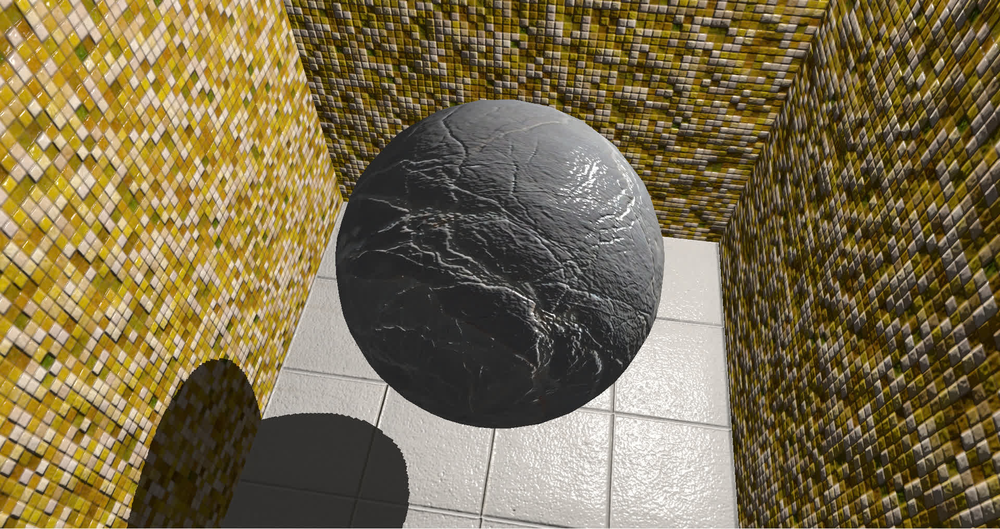

Shader Viewer is a simple framework for protoyping GLSL shader programs. The goal is to provide
a fast and convenient way to setup complex rendering pipelines to demonstrate both singlepass and
multipass shaders. 

However, Shader Viewer is not an engine for real-time applications; it was designed with the 
convenience of writing quick demos and not efficiency in mind.